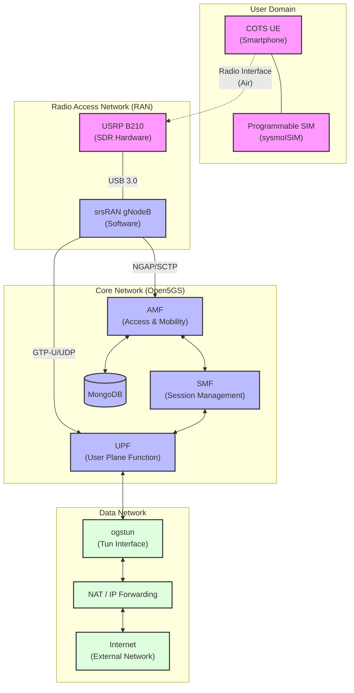

# Private 5G Network Architecture

This repository contains a step-by-step guide to setting up a Private 5G/LTE Network using Open Source software and generic hardware.

## System Overview

The system implements a full 5G network stack, consisting of the following key components:

1.  **User Equipment (UE)**: A Commercial Off-The-Shelf (COTS) smartphone or modem with a programmable SIM card.
2.  **Radio Hardware**: USRP B210 (Software Defined Radio) acting as the RF frontend.
3.  **Radio Access Network (RAN)**: `srsRAN` (specifically `srsenb` or `srsgnb`) handling the base station logic.
4.  **Core Network (CN)**: `Open5GS` providing 5G Core functions (AMF, SMF, UPF, AUSF, UDM, etc.).
5.  **External Network**: The host machine's internet connection, accessed via NAT/IP Forwarding through the `ogstun` interface.

## Architecture Diagram

The following diagram illustrates the data flow and logical connections between components.

## Key Configuration Parameters

Based on the documentation steps:

*   **MCC (Mobile Country Code)**: `001` (Test Network)
*   **MNC (Mobile Network Code)**: `01` (Test Network)
*   **TAC (Tracking Area Code)**: `7`
*   **Network Interface**: `ogstun` (Created by Open5GS for handling user traffic)
*   **Drivers**: UHD (Universal Hardware Driver) for USRP communication.

## Data Flow

1.  **Registration**: The UE communicates via the USRP to srsRAN, which forwards the request to the AMF in Open5GS for authentication (using SIM credentials stored in MongoDB).
2.  **Session Establishment**: Once authenticated, the SMF establishes a PDU session and configures the UPF.
3.  **Traffic Flow**: User data sent from the UE goes through the USRP -> srsRAN -> UPF -> `ogstun` -> NAT -> Internet.
